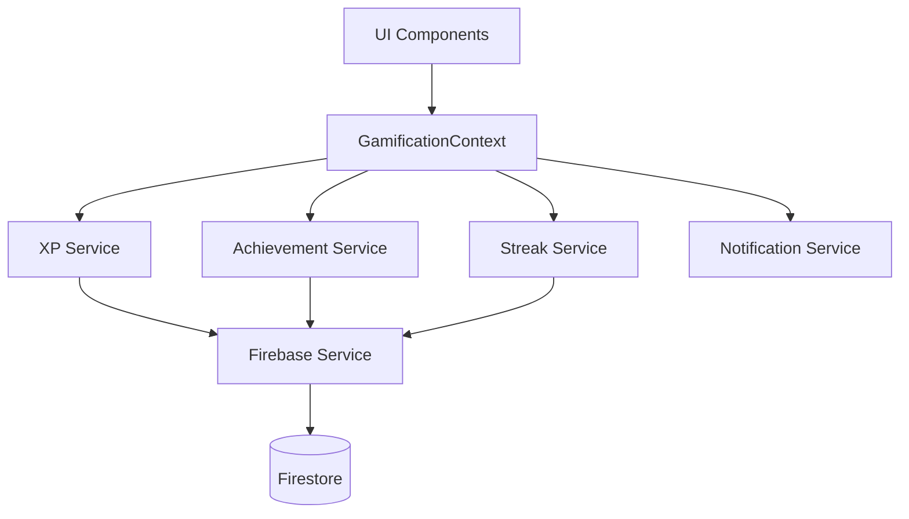

# Design Document: Gamification XP System

## Overview

This design implements a comprehensive gamification XP system for the Vibe Dev learning platform. The system tracks user experience points (XP), manages achievement unlocks, handles level progression, and provides real-time UI feedback. The implementation uses Firebase Firestore for data persistence and React Context for state management, building on the existing gamification data structures defined in `src/data/gamification.ts`.

The system is designed to be event-driven, where user actions (lesson completions, logins, social interactions) trigger XP calculations, achievement checks, and database updates. All XP operations are atomic and include retry logic for reliability.

## Architecture

### High-Level Architecture



### Data Flow

1. **User Action** → Component triggers gamification event
2. **Event Handler** → GamificationContext processes the event
3. **XP Calculation** → XP Service calculates reward amount
4. **Achievement Check** → Achievement Service evaluates unlock conditions
5. **Database Update** → Firebase Service persists changes
6. **UI Update** → Context updates state, triggering re-renders
7. **Notification** → Notification Service displays feedback

### Technology Stack

- **Frontend**: React with TypeScript
- **State Management**: React Context API
- **Database**: Firebase Firestore
- **Real-time Updates**: Firestore onSnapshot listeners
- **Notifications**: Custom toast notification system

## Components and Interfaces

### 1. GamificationContext

Central state management for all gamification features.

```typescript
interface GamificationContextType {
  // State
  xp: number;
  level: number;
  levelInfo: LevelInfo;
  xpProgress: { current: number; needed: number; percentage: number };
  unlockedAchievements: string[];
  streak: number;
  dailyChallenges: DailyChallengeProgress[];
  
  // Actions
  awardXP: (amount: number, reason: string) => Promise<void>;
  completeLesson: (courseId: string, lessonId: string) => Promise<void>;
  completeCourse: (courseId: string) => Promise<void>;
  checkAchievements: () => Promise<void>;
  updateStreak: () => Promise<void>;
  completeDailyChallenge: (challengeId: string) => Promise<void>;
  uploadProject: (projectId: string) => Promise<void>;
  receiveProjectLike: (projectId: string) => Promise<void>;
  
  // Utilities
  showLevelUpNotification: (newLevel: LevelInfo) => void;
  showAchievementNotification: (achievement: Achievement) => void;
}
```

**Implementation Notes:**
- Uses `useReducer` for complex state management
- Subscribes to Firestore user profile for real-time updates
- Debounces rapid XP changes to prevent excessive database writes
- Queues notifications to prevent UI spam

### 2. XP Service

Handles all XP calculations and awards.

```typescript
interface XPService {
  calculateLessonXP: (lessonType: 'video' | 'reading' | 'lab') => number;
  calculateAchievementXP: (achievement: Achievement) => number;
  calculateStreakBonus: (streakDays: number) => number;
  awardXP: (userId: string, amount: number, reason: string) => Promise<void>;
  getXPHistory: (userId: string, limit: number) => Promise<XPTransaction[]>;
}
```

**XP Award Amounts:**
- Video lesson: 25 XP
- Reading lesson: 20 XP
- Lab lesson: 50 XP
- Course completion: 200 XP
- Achievement: Based on tier (bronze: 50, silver: 100, gold: 300, platinum: 500, diamond: 1000)
- Streak bonus: 5 XP per day (max 50 XP at 10+ days)
- Daily challenge: 15-50 XP depending on difficulty
- Project upload: 30 XP
- Project like received: 5 XP

**Implementation:**
```typescript
const XP_REWARDS = {
  lesson: {
    video: 25,
    reading: 20,
    lab: 50
  },
  course: 200,
  achievement: {
    bronze: 50,
    silver: 100,
    gold: 300,
    platinum: 500,
    diamond: 1000
  },
  social: {
    projectUpload: 30,
    likeReceived: 5
  },
  streak: {
    base: 5,
    max: 50
  }
};

async function awardXP(userId: string, amount: number, reason: string): Promise<void> {
  // Validate amount
  if (amount <= 0 || !Number.isInteger(amount)) {
    console.error('Invalid XP amount:', amount);
    return;
  }
  
  // Create transaction record
  const transaction: XPTransaction = {
    userId,
    amount,
    reason,
    timestamp: new Date()
  };
  
  // Update user XP with retry logic
  await retryOperation(async () => {
    await updateDoc(doc(db, 'users', userId), {
      xp: increment(amount)
    });
    
    // Log transaction
    await addDoc(collection(db, 'xpTransactions'), transaction);
  }, 3);
  
  // Check for level up
  const userProfile = await getUserProfile(userId);
  const newLevel = getLevelFromXP(userProfile.xp);
  
  if (newLevel.level > userProfile.level) {
    await updateDoc(doc(db, 'users', userId), {
      level: newLevel.level
    });
  }
}
```

### 3. Achievement Service

Manages achievement unlocking and validation.

```typescript
interface AchievementService {
  checkAchievements: (userId: string, context: AchievementContext) => Promise<Achievement[]>;
  unlockAchievement: (userId: string, achievementId: string) => Promise<void>;
  getUnlockedAchievements: (userId: string) => Promise<string[]>;
  isAchievementUnlocked: (userId: string, achievementId: string) => Promise<boolean>;
}

interface AchievementContext {
  lessonsCompleted?: { courseId: string; lessonId: string }[];
  coursesCompleted?: string[];
  streak?: number;
  totalXP?: number;
  projectsUploaded?: number;
  likesReceived?: number;
}
```

**Achievement Check Logic:**
```typescript
async function checkAchievements(
  userId: string, 
  context: AchievementContext
): Promise<Achievement[]> {
  const userProfile = await getUserProfile(userId);
  const unlockedIds = userProfile.unlockedAchievements || [];
  const newlyUnlocked: Achievement[] = [];
  
  for (const achievement of ACHIEVEMENTS) {
    // Skip if already unlocked
    if (unlockedIds.includes(achievement.id)) continue;
    
    // Check requirement
    const meetsRequirement = evaluateRequirement(achievement.requirement, context, userProfile);
    
    if (meetsRequirement) {
      await unlockAchievement(userId, achievement.id);
      newlyUnlocked.push(achievement);
    }
  }
  
  return newlyUnlocked;
}

function evaluateRequirement(
  requirement: Achievement['requirement'],
  context: AchievementContext,
  userProfile: UserProfile
): boolean {
  switch (requirement.type) {
    case 'lesson_complete':
      const lessonsInCourse = context.lessonsCompleted?.filter(
        l => l.courseId === requirement.courseId
      ).length || 0;
      return lessonsInCourse >= requirement.value;
      
    case 'course_complete':
      return (context.coursesCompleted?.length || 0) >= requirement.value;
      
    case 'streak':
      return (context.streak || userProfile.streakDays) >= requirement.value;
      
    case 'xp_total':
      return (context.totalXP || userProfile.xp) >= requirement.value;
      
    case 'projects':
      return (context.projectsUploaded || userProfile.savedProjects.length) >= requirement.value;
      
    case 'likes':
      return (context.likesReceived || 0) >= requirement.value;
      
    default:
      return false;
  }
}
```

### 4. Streak Service

Manages daily login streaks.

```typescript
interface StreakService {
  updateStreak: (userId: string) => Promise<number>;
  getStreakInfo: (userId: string) => Promise<StreakInfo>;
  resetStreak: (userId: string) => Promise<void>;
}

interface StreakInfo {
  currentStreak: number;
  lastLogin: Date;
  longestStreak: number;
  streakActive: boolean;
}
```

**Streak Calculation Logic:**
```typescript
async function updateStreak(userId: string): Promise<number> {
  const userProfile = await getUserProfile(userId);
  const now = new Date();
  const lastLogin = userProfile.lastLogin?.toDate() || new Date(0);
  
  // Calculate hours since last login
  const hoursSinceLastLogin = (now.getTime() - lastLogin.getTime()) / (1000 * 60 * 60);
  
  let newStreak: number;
  
  if (hoursSinceLastLogin < 24) {
    // Same day, no change
    newStreak = userProfile.streakDays;
  } else if (hoursSinceLastLogin < 48) {
    // Next day, increment streak
    newStreak = userProfile.streakDays + 1;
    
    // Award streak bonus XP
    const bonusXP = Math.min(newStreak * 5, 50);
    await awardXP(userId, bonusXP, `Streak bonus (${newStreak} days)`);
  } else {
    // Missed a day, reset to 1
    newStreak = 1;
  }
  
  // Update database
  await updateDoc(doc(db, 'users', userId), {
    streakDays: newStreak,
    lastLogin: serverTimestamp()
  });
  
  return newStreak;
}
```

### 5. Notification Service

Displays gamification notifications.

```typescript
interface NotificationService {
  showXPGain: (amount: number, reason: string) => void;
  showLevelUp: (newLevel: LevelInfo) => void;
  showAchievementUnlock: (achievement: Achievement) => void;
  showStreakUpdate: (streak: number) => void;
}
```

**Notification Components:**
- **XP Toast**: Small floating notification showing "+X XP" with reason
- **Level Up Modal**: Full-screen celebration with new level info and perks
- **Achievement Unlock**: Animated card showing achievement details
- **Streak Badge**: Corner notification showing current streak

## Data Models

### Firestore Collections

#### users Collection
```typescript
interface UserDocument {
  uid: string;
  email: string | null;
  displayName: string | null;
  photoURL: string | null;
  
  // Gamification fields
  xp: number;
  level: number;
  streakDays: number;
  lastLogin: Timestamp;
  unlockedAchievements: string[]; // achievement IDs
  
  // Course progress
  enrolledCourses: string[];
  courseProgress: CourseProgress[];
  
  // Social
  savedProjects: string[];
  likedProjects: string[];
  
  // Profile
  bio?: string;
  location?: string;
  role?: string;
  bannerURL?: string;
}

interface CourseProgress {
  courseId: string;
  completedLessons: string[]; // lesson IDs
  completedModules: string[]; // module IDs
  lastPlayed: Timestamp;
  courseCompleted: boolean;
}
```

#### xpTransactions Collection
```typescript
interface XPTransaction {
  userId: string;
  amount: number;
  reason: string;
  timestamp: Timestamp;
  metadata?: {
    courseId?: string;
    lessonId?: string;
    achievementId?: string;
  };
}
```

#### achievementUnlocks Collection
```typescript
interface AchievementUnlock {
  userId: string;
  achievementId: string;
  unlockedAt: Timestamp;
  xpAwarded: number;
}
```

#### dailyChallengeProgress Collection
```typescript
interface DailyChallengeProgress {
  userId: string;
  challengeId: string;
  completedAt: Timestamp;
  xpAwarded: number;
  date: string; // YYYY-MM-DD format for daily reset
}
```

### Firestore Indexes

Required composite indexes:
- `xpTransactions`: (userId, timestamp DESC)
- `achievementUnlocks`: (userId, unlockedAt DESC)
- `dailyChallengeProgress`: (userId, date DESC)

## Correctness Properties

*A property is a characteristic or behavior that should hold true across all valid executions of a system—essentially, a formal statement about what the system should do. Properties serve as the bridge between human-readable specifications and machine-verifiable correctness guarantees.*

### Property 1: XP Non-Negativity
*For any* user profile, the XP value should always be a non-negative integer.
**Validates: Requirements 1.5**

### Property 2: XP Persistence Consistency
*For any* XP award operation, if the operation succeeds, then querying the user's XP immediately after should reflect the awarded amount.
**Validates: Requirements 1.2**

### Property 3: Achievement Unlock Idempotence
*For any* achievement and user, unlocking the same achievement multiple times should result in the achievement being unlocked exactly once and XP being awarded exactly once.
**Validates: Requirements 2.5**

### Property 4: Level Calculation Consistency
*For any* XP value, calculating the level from XP should always return a level where the XP falls within that level's min and max range.
**Validates: Requirements 3.1**

### Property 5: Lesson Completion Idempotence
*For any* lesson, completing the same lesson multiple times should only award XP once and only record the completion once.
**Validates: Requirements 4.4**

### Property 6: Streak Increment Logic
*For any* user with a valid streak, if they log in within 24-48 hours of their last login, their streak should increment by exactly 1.
**Validates: Requirements 5.2**

### Property 7: Streak Reset Logic
*For any* user with a streak, if they log in more than 48 hours after their last login, their streak should reset to 1.
**Validates: Requirements 5.3**

### Property 8: Daily Challenge Reset
*For any* daily challenge completed on day D, attempting to complete the same challenge on day D should not award additional XP, but completing it on day D+1 should award XP.
**Validates: Requirements 6.5**

### Property 9: Achievement Requirement Evaluation
*For any* achievement with a numeric requirement (e.g., complete 5 lessons), the achievement should unlock if and only if the user's progress meets or exceeds the requirement value.
**Validates: Requirements 2.1**

### Property 10: XP Transaction Logging
*For any* XP award operation that succeeds, there should exist exactly one corresponding XP transaction record in the database.
**Validates: Requirements 1.2**

## Error Handling

### Error Categories

1. **Database Errors**
   - Connection failures
   - Permission denied
   - Document not found
   - Write conflicts

2. **Validation Errors**
   - Invalid XP amounts (negative, non-integer)
   - Invalid achievement IDs
   - Malformed user data

3. **Business Logic Errors**
   - Duplicate achievement unlocks
   - Invalid level calculations
   - Streak calculation errors

### Error Handling Strategy

```typescript
async function retryOperation<T>(
  operation: () => Promise<T>,
  maxRetries: number = 3,
  delayMs: number = 1000
): Promise<T> {
  let lastError: Error;
  
  for (let attempt = 1; attempt <= maxRetries; attempt++) {
    try {
      return await operation();
    } catch (error) {
      lastError = error as Error;
      console.error(`Attempt ${attempt} failed:`, error);
      
      if (attempt < maxRetries) {
        await new Promise(resolve => setTimeout(resolve, delayMs * attempt));
      }
    }
  }
  
  throw new Error(`Operation failed after ${maxRetries} attempts: ${lastError.message}`);
}

function handleGamificationError(error: Error, context: string): void {
  console.error(`Gamification error in ${context}:`, error);
  
  // Log to error tracking service (e.g., Sentry)
  // logError(error, { context, timestamp: new Date() });
  
  // Show user-friendly message
  showNotification({
    type: 'error',
    message: 'Something went wrong with your progress. Please try again.',
    duration: 5000
  });
}
```

### Fallback Behavior

- If XP update fails, queue the operation for retry on next user action
- If achievement check fails, skip silently and retry on next eligible action
- If notification fails, log but don't block the operation
- If level calculation fails, use previous level as fallback

## Testing Strategy

### Unit Tests

Test individual functions and utilities:
- XP calculation functions
- Level determination logic
- Achievement requirement evaluation
- Streak calculation logic
- Date/time utilities

**Example Unit Tests:**
```typescript
describe('XP Calculation', () => {
  test('calculates correct XP for video lesson', () => {
    expect(calculateLessonXP('video')).toBe(25);
  });
  
  test('calculates correct XP for lab lesson', () => {
    expect(calculateLessonXP('lab')).toBe(50);
  });
  
  test('calculates achievement XP based on tier', () => {
    const achievement: Achievement = {
      id: 'test',
      tier: 'gold',
      xpReward: 300,
      // ... other fields
    };
    expect(calculateAchievementXP(achievement)).toBe(300);
  });
});

describe('Level Progression', () => {
  test('returns correct level for XP value', () => {
    expect(getLevelFromXP(0).level).toBe(1);
    expect(getLevelFromXP(150).level).toBe(2);
    expect(getLevelFromXP(500).level).toBe(3);
  });
  
  test('handles maximum level correctly', () => {
    const maxLevel = getLevelFromXP(10000);
    expect(maxLevel.level).toBe(10);
    expect(maxLevel.maxXP).toBe(Infinity);
  });
});
```

### Property-Based Tests

Test universal properties across many inputs:

**Property Test 1: XP Non-Negativity**
```typescript
import fc from 'fast-check';

test('Property 1: XP values are always non-negative', () => {
  fc.assert(
    fc.property(
      fc.integer({ min: 0, max: 100000 }), // Random XP values
      (xp) => {
        const level = getLevelFromXP(xp);
        expect(level.minXP).toBeGreaterThanOrEqual(0);
        expect(xp).toBeGreaterThanOrEqual(0);
      }
    ),
    { numRuns: 100 }
  );
});
```

**Property Test 2: Level Calculation Consistency**
```typescript
test('Property 4: Level calculation is consistent with XP ranges', () => {
  fc.assert(
    fc.property(
      fc.integer({ min: 0, max: 10000 }),
      (xp) => {
        const level = getLevelFromXP(xp);
        expect(xp).toBeGreaterThanOrEqual(level.minXP);
        expect(xp).toBeLessThan(level.maxXP);
      }
    ),
    { numRuns: 100 }
  );
});
```

**Property Test 3: Achievement Unlock Idempotence**
```typescript
test('Property 3: Unlocking achievement multiple times has same effect as once', async () => {
  fc.assert(
    fc.asyncProperty(
      fc.constantFrom(...ACHIEVEMENTS.map(a => a.id)),
      async (achievementId) => {
        const userId = 'test-user-' + Math.random();
        
        // Unlock once
        await unlockAchievement(userId, achievementId);
        const profile1 = await getUserProfile(userId);
        const xp1 = profile1.xp;
        const unlocked1 = profile1.unlockedAchievements;
        
        // Unlock again
        await unlockAchievement(userId, achievementId);
        const profile2 = await getUserProfile(userId);
        const xp2 = profile2.xp;
        const unlocked2 = profile2.unlockedAchievements;
        
        // Should be identical
        expect(xp1).toBe(xp2);
        expect(unlocked1).toEqual(unlocked2);
        expect(unlocked2.filter(id => id === achievementId).length).toBe(1);
      }
    ),
    { numRuns: 50 }
  );
});
```

**Property Test 4: Lesson Completion Idempotence**
```typescript
test('Property 5: Completing same lesson multiple times awards XP once', async () => {
  fc.assert(
    fc.asyncProperty(
      fc.record({
        courseId: fc.constantFrom('course-1', 'course-2', 'course-3'),
        lessonId: fc.string({ minLength: 5, maxLength: 20 })
      }),
      async ({ courseId, lessonId }) => {
        const userId = 'test-user-' + Math.random();
        
        // Complete lesson first time
        await completeLesson(userId, courseId, lessonId);
        const xp1 = (await getUserProfile(userId)).xp;
        
        // Complete lesson second time
        await completeLesson(userId, courseId, lessonId);
        const xp2 = (await getUserProfile(userId)).xp;
        
        // XP should not increase
        expect(xp1).toBe(xp2);
      }
    ),
    { numRuns: 50 }
  );
});
```

**Property Test 5: Streak Logic**
```typescript
test('Property 6 & 7: Streak increments or resets based on time', async () => {
  fc.assert(
    fc.asyncProperty(
      fc.integer({ min: 1, max: 100 }), // hours since last login
      async (hoursSinceLastLogin) => {
        const userId = 'test-user-' + Math.random();
        
        // Set up user with existing streak
        const initialStreak = 5;
        await setupUserWithStreak(userId, initialStreak, hoursSinceLastLogin);
        
        // Update streak
        const newStreak = await updateStreak(userId);
        
        if (hoursSinceLastLogin < 24) {
          // Same day, no change
          expect(newStreak).toBe(initialStreak);
        } else if (hoursSinceLastLogin < 48) {
          // Next day, increment
          expect(newStreak).toBe(initialStreak + 1);
        } else {
          // Missed day, reset
          expect(newStreak).toBe(1);
        }
      }
    ),
    { numRuns: 100 }
  );
});
```

### Integration Tests

Test complete workflows:
- User completes lesson → XP awarded → Achievement unlocked → Level up
- User logs in daily → Streak increments → Streak achievement unlocked
- User uploads project → XP awarded → Social achievement unlocked

### Testing Configuration

- **Property tests**: Minimum 100 iterations per test
- **Test framework**: Vitest
- **Property testing library**: fast-check
- **Each property test references its design property**: `// Feature: gamification-xp-system, Property 1: XP Non-Negativity`

## Implementation Notes

### Performance Considerations

1. **Debounce XP Updates**: Batch multiple XP awards within 1 second to reduce database writes
2. **Cache Level Calculations**: Memoize level lookups for the same XP value
3. **Lazy Achievement Checks**: Only check achievements relevant to the action performed
4. **Optimize Firestore Queries**: Use composite indexes for common query patterns

### Security Considerations

1. **Firestore Security Rules**: Ensure users can only modify their own XP/achievements
2. **Server-Side Validation**: Validate all XP amounts on the server
3. **Rate Limiting**: Prevent XP farming by rate-limiting certain actions
4. **Audit Trail**: Log all XP transactions for fraud detection

### Migration Strategy

1. Add new fields to existing user documents with default values
2. Create new collections for XP transactions and achievement unlocks
3. Backfill existing user data if needed
4. Deploy new code with feature flag
5. Monitor for errors and rollback if needed

## Future Enhancements

- Leaderboards for competitive XP rankings
- Weekly challenges with special rewards
- XP multiplier events (2x XP weekends)
- Achievement badges displayed on user profiles
- XP shop for cosmetic rewards
- Team/guild system for collaborative XP earning
